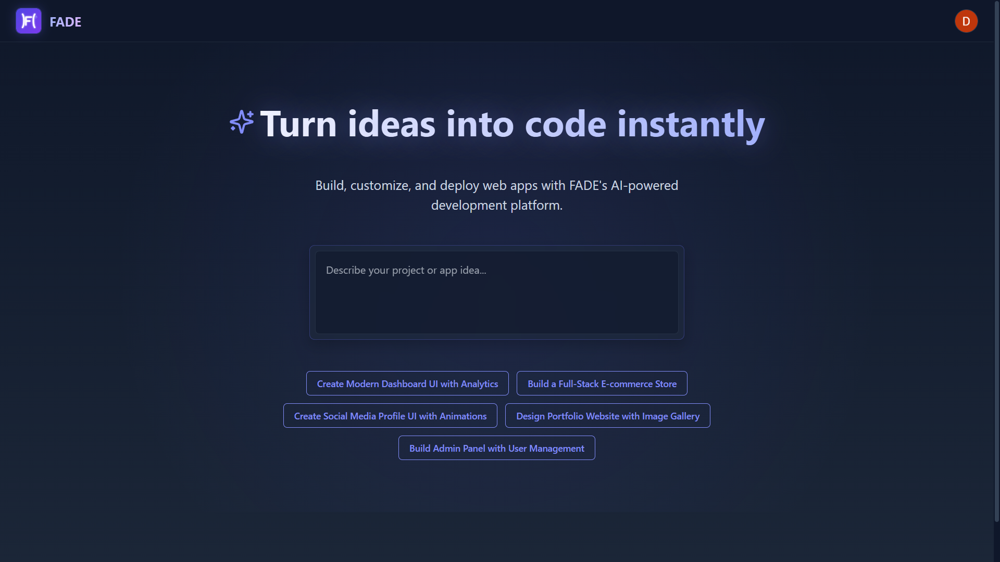

#  FADE - AI-Powered Code Generation Platform

[](https://fade-ai.vercel.app/)
[](https://github.com/nasserml/fade)
[](https://opensource.org/licenses/MIT)
[](https://nextjs.org/)
[](https://tailwindcss.com/)

<p align="center">
  
</p>

<p align="center">
  <b>Transform your ideas into code instantly with FADE's AI-powered development platform</b>
</p>

**FADE** is an elegant, open-source AI code generation platform that helps developers build applications faster. Describe what you want to create, and watch as FADE generates the code for you in real-time with an interactive preview.

## ✨ Features



### 🤖 AI-Powered Code Generation
Harness the power of Google's Gemini AI to transform your ideas into functional code. Just describe what you want to build, and FADE will generate the complete implementation for you.


### 💻 Interactive Workspace
Work in a sleek, intuitive environment where you can edit code, chat with the AI assistant, and see your changes in real-time.


### 🔄 Instant Preview
See your code come to life with a live preview that updates as you make changes. FADE automatically switches to the preview when your code is ready, providing immediate feedback.


### Other Key Features
- **💬 Intelligent Chat Assistant**: Get coding help, explanations, and debugging assistance
- **🔒 Secure Authentication**: Simple and secure login with Google OAuth
- **💾 Project Persistence**: Your work is automatically saved for future access
- **🌐 Cross-Platform Access**: Use from any device with a web browser

## 🚀 Getting Started

### Quick Start
1. Visit [FADE Live Demo](https://fade-ai.vercel.app/)
2. Sign in with your Google account
3. Enter your project idea in the input field
4. Watch as FADE generates your code with live preview

### Run Locally

#### Prerequisites
- Node.js (v16+)
- npm, yarn, or pnpm
- Google Cloud account for API keys
- Convex account for backend

#### Installation

1. **Clone the repository**
   ```bash
   https://github.com/Riddhish1/FADE.git
   cd FADE
   ```

2. **Install dependencies**
   ```bash
   npm install
   # or
   yarn install
   # or
   pnpm install
   ```

3. **Set up environment variables**
   Create a `.env.local` file in the root directory:
   ```
   NEXT_PUBLIC_GOOGLE_AUTH_CLIENT_ID=<your_google_auth_client_id>
   CONVEX_DEPLOYMENT=<your_convex_deployment>
   NEXT_PUBLIC_CONVEX_URL=<your_convex_url>
   NEXT_PUBLIC_GEMINI_API_KEY=<your_gemini_api_key>
   ```

4. **Start the development server**
   ```bash
   npm run dev
   # or
   yarn dev
   # or
   pnpm dev
   ```

5. **Open your browser**
   Navigate to http://localhost:3000 to see FADE in action.

## 🛠️ Technology Stack

FADE is built with modern technologies for optimal performance and developer experience:

- **Frontend**: Next.js 14, React, Tailwind CSS
- **Backend**: Convex for real-time database and serverless functions
- **AI**: Google Gemini AI for code generation and assistant
- **Code Preview**: Sandpack for interactive code previews
- **Styling**: TailwindCSS for responsive design
- **Authentication**: Google OAuth for secure login

## 📂 Project Structure

```
fade/
├── app/                      # Main Next.js application
│   ├── (main)/               # Main routes (workspace)
│   ├── api/                  # API routes for AI services
│   ├── layout.js             # Root layout with metadata
│   └── page.js               # Home page
├── components/               # UI components
│   ├── custom/               # Application-specific components
│   └── ui/                   # Reusable UI components
├── convex/                   # Backend logic and database schema
├── data/                     # Static data and configuration
├── docs/                     # Documentation and screenshots
├── public/                   # Static assets
└── styles/                   # Global styles
```

## 🔧 Configuration

### Convex Setup
1. Create a Convex account at [convex.dev](https://convex.dev)
2. Initialize a new project and get your deployment URL
3. Add your Convex URL to your environment variables

### Google AI Setup
1. Create a Google Cloud project
2. Enable the Gemini API
3. Create API credentials and add them to your environment variables

## 🤝 Contributing

We welcome contributions! Here's how you can help:

1. **Fork the repository**
2. **Create your feature branch**
   ```bash
   git checkout -b feature/amazing-feature
   ```
3. **Commit your changes**
   ```bash
   git commit -m 'Add some amazing feature'
   ```
4. **Push to the branch**
   ```bash
   git push origin feature/amazing-feature
   ```
5. **Open a Pull Request**

Please ensure your code follows our style guidelines and includes appropriate tests.

## 📝 License

FADE is released under the MIT License. See the [LICENSE](LICENSE) file for details.

## 💖 Support & Donations

If you find FADE helpful, consider supporting its development through:

- **⭐ Star the repository**: Show your appreciation and help others discover FADE
- **📣 Share with others**: Tell your friends and colleagues about FADE
- **🐛 Report bugs**: Help us improve by reporting any issues you encounter
- **💡 Suggest features**: Let us know what would make FADE more useful for you

## 🙏 Acknowledgements

- The amazing [Next.js](https://nextjs.org/) team for their incredible framework
- [Convex](https://www.convex.dev/) for their powerful backend platform
- [Google AI](https://ai.google/) for their generative AI capabilities
- All our contributors and supporters

---
